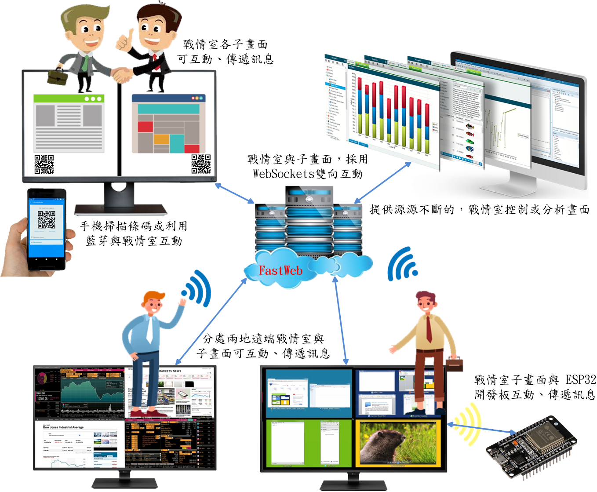

# 戰情指揮系統dashboard_command
經由條件設置。任意指定播放場域，無論是生產現場、會議室、遠端視訊會議，均能應對自如。戰情顯示可以分割不同子畫面，同時展現關聯內容，不放過任何資訊。以往想控制大屏上的顯示內容，都使用紅外線遙控器，現在人們普遍「機不離手」，戰情指揮系統使用手機控制大屏。只需在手機下載大屏遙控器應用程式，就可以連接播放器，控制大屏，開始遙控。而且手機的遙控介面比傳統的遙控器簡潔。戰情指揮系統包括以下三部分，數控遙控器、數控播放器、數控控制器。

> **加入 Facebook 社團**
>
> [https://www.facebook.com/groups/isoface/](https://www.facebook.com/groups/isoface/)
> 
> **點讚追蹤 Facebook 粉絲專頁**
> 
> [https://www.facebook.com/AIOT.ERP](https://www.facebook.com/AIOT.ERP)

## 一、數控遙控器

使用PinToo 開發的 Android 手機 APP，控制各種大屏投影應用，與數控播放器連接完成，可使用數控遙控器、投屏、切換主題或應用單元、遠端協助等功能，提供便捷的大屏展示體驗。

數控遙控器功能包括：

1. 選取要控制的遠端大屏。

2. 視訊投屏，各種數控內容圖片、視頻、分析圖表、網頁、應用程式操作畫面，一鍵投放至大屏。

3. 控制與切換大屏顯示主題或應用單元。

4. 控制與切換大屏各個子螢幕主題內容。

5. 遠程協助，無論處在何地，都可以遠端控制大屏。

6. 截屏錄屏，快捷鍵電視截圖錄屏，記錄大屏美好瞬間。

7. 遠端桌面，將大屏展示做為，遠端桌面配合遠程教學與會議使用。

**炫酷的戰情室風格，體現科技感**

內附圖表和元件，提供豐富的配置，為智慧園區、智慧城市、智慧工廠等打造精彩的圖表。

多種圖表與樣式，簡單設置即可實現輪播功能，隨時隨地查看戰情室中的圖表，掌握企業管理資料。可將戰情室頁面轉出至互動報表、定期報表、PDF檔案，供外出開會時使用。

**跨平台與多種數據庫的資料源輕鬆整合，經營全貌清晰展現**

整合多源資料與API呼叫，自訂企業風格，動態展示，將各部門零散數據資料統一展示。

透過互動功能與警示燈號，企業管理績效一目瞭然，並可向下追蹤至相關明細頁面。

適用於大螢幕電視牆、多螢幕拼接、資訊看版等裝置播放，支援遠地螢幕、資訊看版等裝置播放。

## 二、數控播放器
包括Windows桌面播放器、Web播放器、Android APP播放器，連接各式螢幕，顯示大屏播放主題。數控播放器設置為主動式，可依照所設置之主題，循序自動播放。如果設置為遙控式，用戶操控數控控制器，任意控制播放主題或切換應用單元。播放器採用 Smart 軟體開發工具，支援多語言，預設中文繁體、簡體、英文，軟體安裝時自動跟隨作業系統語言改變

## 三、數控控制器

數控控制器，設置播放器要投屏的主題內容，與大屏子螢幕顯示排列方式。

戰情指揮系統採用開放式架構，整合多種軟體與資料源，利用 Web 特質，無限擴展，打造全方位企業資訊平台，提昇開發效率並創造數據價值。戰情指揮系統播放內容包括︰

戰情室圖表分析、各式管理表單、SCADA、HMI、企業資訊系統運維、物聯網平台、影像監控、視訊會議、視訊教學、網路考試、網路問卷調查、線上直播、線上遊戲展示、投影片、圖片、視訊播放、

廣告推播、模擬控制、人車GPS定位、QRCode掃描、遠端桌面。播放內容可搭配功能，包括語音說明、音樂特效、文字轉語音、WebSocket 訊息傳送、IsoBean 互動。

戰情指揮系統以超乎想像的運作模式，自行研發軟體開工具製作。ERP、物聯網、AI、定位、SCADA、HMI、Web、微服務、移動設備....全球數控中心，多元化互動整合架構，無需採用其它軟體，全部一條龍服務到底

① SCADA、HMI、物聯網，採用 Smart設計

② 企業經營管理，採用 FastERP 設計

③ 定位控制器，採用 PinToo 與 Smart 設計

④ ESP32 開發板，使用 M5Stack，並用 Arduino 設計

⑤ Web 雲平台，採用 FastWeb 開發設計

⑥ 數據庫服務，採用 TARS 運行應用程式服務器

⑦ 戰情播放控制器(Windows)，採用 Smart 設計

⑧ 戰情遙控器(Android)，採用 PinToo 設計

⑨ 戰情播放器(Windows平台)，採用 Smart 設計

⑩ 戰情播放器(Android電視)，採用 PinToo 設計

**戰情指揮系統所有子畫面都能遠地互動整合**

戰情室每個螢幕區塊，使用IsoBean微服務搭配 RestAPI快速組合應用。利用 WebSocket 或其它通訊協定，戰情室各螢幕區塊可即時控制實務作業運行(ERP、MES、SACDA..) 。戰情指揮系統具備二次開發功能，跨平台多設備端使用，在既有源碼的基礎，可任意擴充系統功能，在手機、平板、PC、大螢幕等多種裝置上展示。

